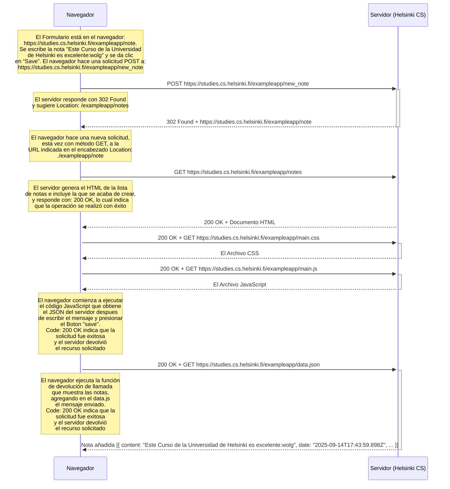

# 🎓 Curso de Desarrollador University of Helsinki

**University of Helsinki:** [🔗 University of Helsinki Helsinki](https://www.helsinki.fi/en)
---

## 📄 TAREA: *0.4: Nuevo diagrama de nota*

**Autor:** William O Lozano G.  
**Repositorio oficial:** [🔗 GitHub - Curso Universidad Helsinki](https://github.com/wolgprogramador-cell/CursoUniversidadHelsinki.git)  
**Fecha de actualización:** 2025-09-14  

---

## 📒   04 Nuevo diagrama de nota.

Este diagrama ilustra el flujo de interacción entre el **navegador del cliente** y el **servidor remoto** cuando un usuario crea una nueva nota en la aplicación web de una sola página (SPA) https://studies.cs.helsinki.fi/exampleapp/new_note de la Universidad de Helsinki. 

> 💡 **Contexto**: Tras cargar la interfaz inicial, el usuario ingresa un mensaje en el campo de texto y hace clic en el botón *“Save”*. Esto desencadena una nueva secuencia de solicitudes HTTP que culmina en la actualización del contenido visual sin recargar la página.

### 📚 DIAGRAMA DE SECUENCIA

