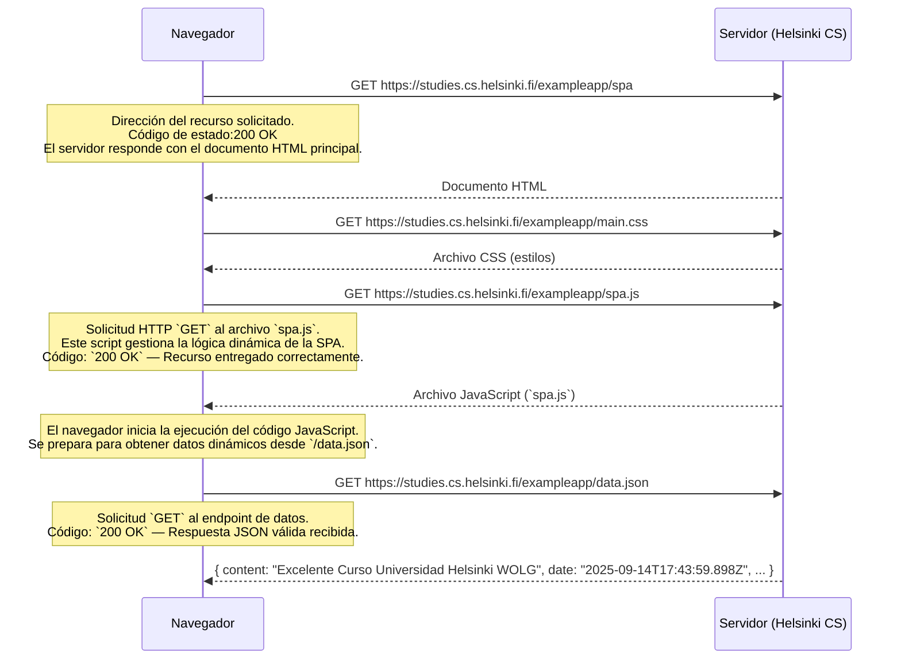

# 🎓 Curso de Desarrollador University of Helsinki

**University of Helsinki:** [🔗 University of Helsinki Helsinki](https://www.helsinki.fi/en)
---

## 📄 TAREA: *0.5: Diagrama de aplicación de una sola página*

**Autor:** William O Lozano G.  
**Repositorio oficial:** [🔗 GitHub - Curso Universidad Helsinki](https://github.com/wolgprogramador-cell/CursoUniversidadHelsinki.git)  
**Fecha de actualización:** 2025-09-14  

---

## 📒 0.5: Diagrama de Aplicación de Una Sola Página (SPA)

Este diagrama ilustra el flujo de comunicación entre el **navegador del cliente** y el **servidor remoto** en una aplicación web moderna de la página https://studies.cs.helsinki.fi/exampleapp/spa  donde todos los recursos se cargan dinámicamente mediante solicitudes asíncronas.

### 📚 DIAGRAMA DE SECUENCIA

